# Bluetooth Music Player

A beginner Android project for learning **Bluetooth** by building a small media player that can find headphones, pair with them, and play one local MP3 track.

**Goal so far:** scan for nearby Bluetooth devices, show them in a simple UI, pick headphones to pair with, then play `studymusic.mp3` from `res/raw`.

---

## What this app does right now

1. Asks for Bluetooth permissions
2. Scans for nearby (and already paired) Bluetooth devices
3. Lists them in a Compose UI (audio/headphone-looking devices first)
4. Lets you tap a device to start pairing
5. Plays `R.raw.studymusic` with `MediaPlayer` when you tap **Play**

**Important beginner note:** pairing a device is not always the same as having audio going to the headphones. Android usually routes music to headphones only after they are **connected** as an audio device in system Bluetooth settings. The app plays the track either way; if headphones are not the active audio output, you may hear the phone speaker instead.

---

## Project pieces (big picture)

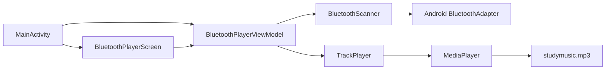

| Piece | Role |
| --- | --- |
| `MainActivity` | App entry point. Requests permissions and shows the UI. |
| `BluetoothPlayerScreen` | Compose UI: status, Scan/Play buttons, device list. |
| `BluetoothPlayerViewModel` | Holds UI state and connects the screen to Bluetooth + music. |
| `BluetoothScanner` | Starts discovery, listens for found devices, starts pairing. |
| `DiscoveredDevice` | Simple data model for one row in the list (name, address, paired?). |
| `TrackPlayer` | Thin wrapper around `MediaPlayer` for play / pause / stop. |
| `AndroidManifest.xml` | Declares Bluetooth permissions the app needs. |
| `res/raw/studymusic.mp3` | The one track we play. |

---

## User flow


---

## How Bluetooth scanning works here

Classic Bluetooth discovery (the “find nearby devices” style) is used — good for many headphones.

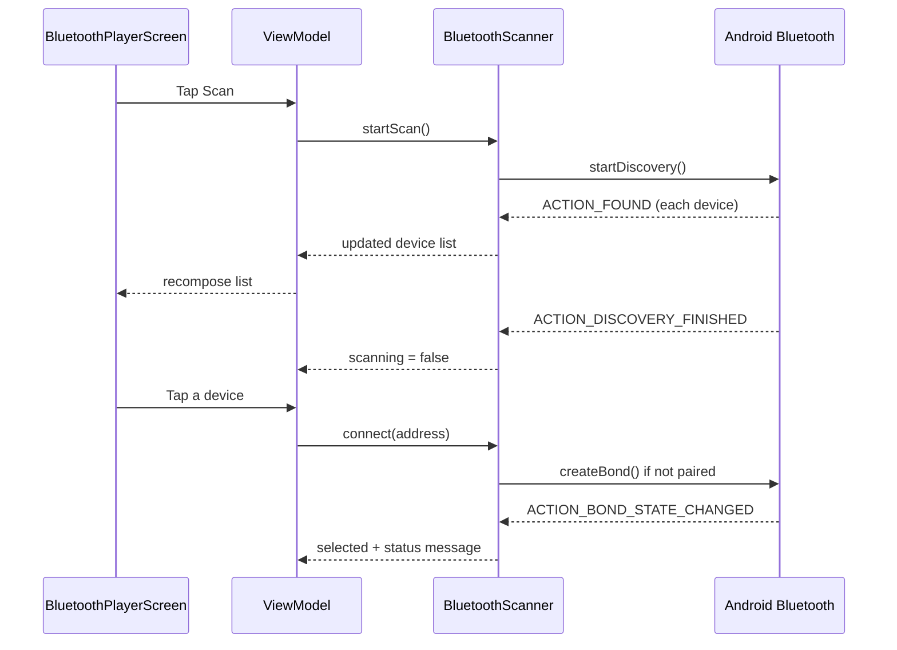

### Beginner terms

- **Scan / discovery:** the phone listens for nearby Bluetooth devices advertising themselves.
- **Bond / pair:** save a trusted relationship with the device (PIN/confirm if needed).
- **Connect (audio):** the headphones are actively linked for sound (A2DP). The system usually manages this; our app currently focuses on scan + pair + play.
- **MAC address:** the unique `AA:BB:…` id shown under each device name.

---

## How playback works here

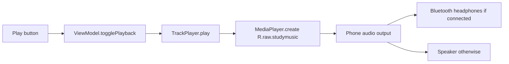

The app does **not** manually “send MP3 bytes over Bluetooth.” It plays locally with `MediaPlayer`; Android’s audio system chooses the output device.

---

## Permissions (why the app asks)

| Android version | Permissions used |
| --- | --- |
| API 31+ (Android 12+) | `BLUETOOTH_SCAN`, `BLUETOOTH_CONNECT` |
| Older | `BLUETOOTH`, `BLUETOOTH_ADMIN`, `ACCESS_FINE_LOCATION` |

These are declared in `AndroidManifest.xml` and requested at runtime from `MainActivity`.

---

## Folder map

```text
app/src/main/
├── AndroidManifest.xml
├── java/com/rick/bluetoothmusicplayer/
│   ├── MainActivity.kt
│   ├── BluetoothPlayerViewModel.kt
│   ├── audio/
│   │   └── TrackPlayer.kt
│   ├── bluetooth/
│   │   ├── BluetoothScanner.kt
│   │   └── DiscoveredDevice.kt
│   └── ui/
│       ├── BluetoothPlayerScreen.kt
│       └── theme/          (Material theme colors/fonts)
└── res/raw/
    └── studymusic.mp3
```

---

## Try it

1. Run the app on a real phone (Bluetooth headphones are much easier to test than an emulator).
2. Grant permissions.
3. Put headphones in pairing mode → **Scan**.
4. Tap the headphones in the list to pair/select.
5. In phone **Settings → Bluetooth**, confirm they show as connected.
6. Tap **Play**.

---

## What’s next (not built yet)

Ideas for later learning steps:

- Detect whether headphones are actually **connected** for audio (A2DP state), not only paired
- Auto-play when headphones connect
- Show playback progress / seek bar
- Stop scan automatically after a timeout
- Clearer “connected vs paired” labels in the UI

---

## State machines (simple → complex)

These diagrams describe how different parts of the app move between states. Start at the top; each section adds more detail. Some states are **exactly what the code tracks today**; others include Android system states we rely on but do not fully model yet.

### 1. Permissions (simple)

`MainActivity` requests runtime permissions; `PlayerUiState.hasPermissions` stores the result.

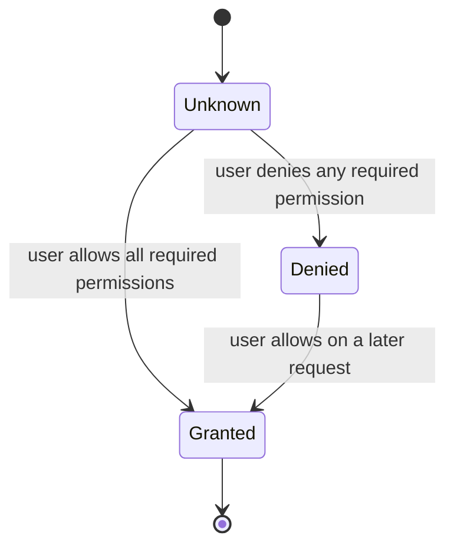

**Required today**

- Android 12+: `BLUETOOTH_SCAN`, `BLUETOOTH_CONNECT`
- Older: `BLUETOOTH`, `BLUETOOTH_ADMIN`, `ACCESS_FINE_LOCATION`

---

### 2. Bluetooth radio (simple)

Tracked roughly as `bluetoothAvailable` + `bluetoothEnabled`.

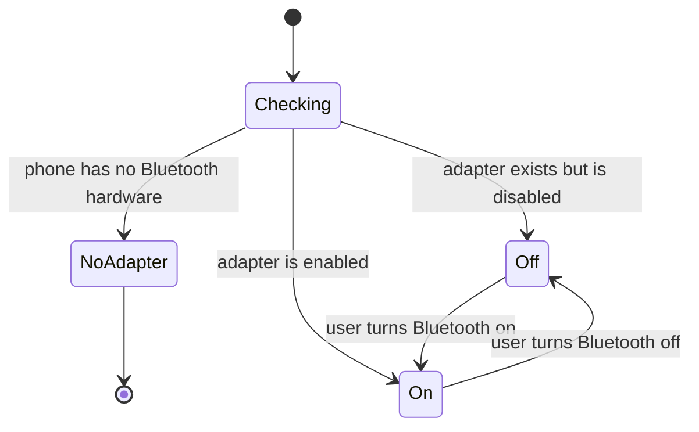

In code, `BluetoothScanner` also listens for `ACTION_STATE_CHANGED` and clears the device list when Bluetooth turns off.

---

### 3. Discovery / scan (simple)

Driven by `isScanning` and Android discovery broadcasts.

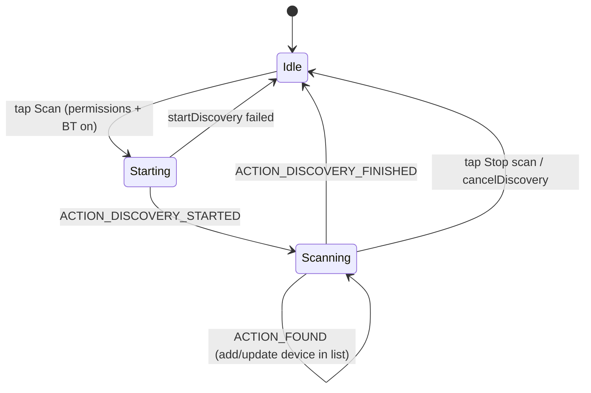

While scanning, bonded devices stay visible; non-bonded “nearby” entries are refreshed at the start of a new scan.

---

### 4. One device’s bond / pair state (medium)

Android `BluetoothDevice` bond states. Our UI maps them to labels like `Available`, `Pairing…`, `Paired`.

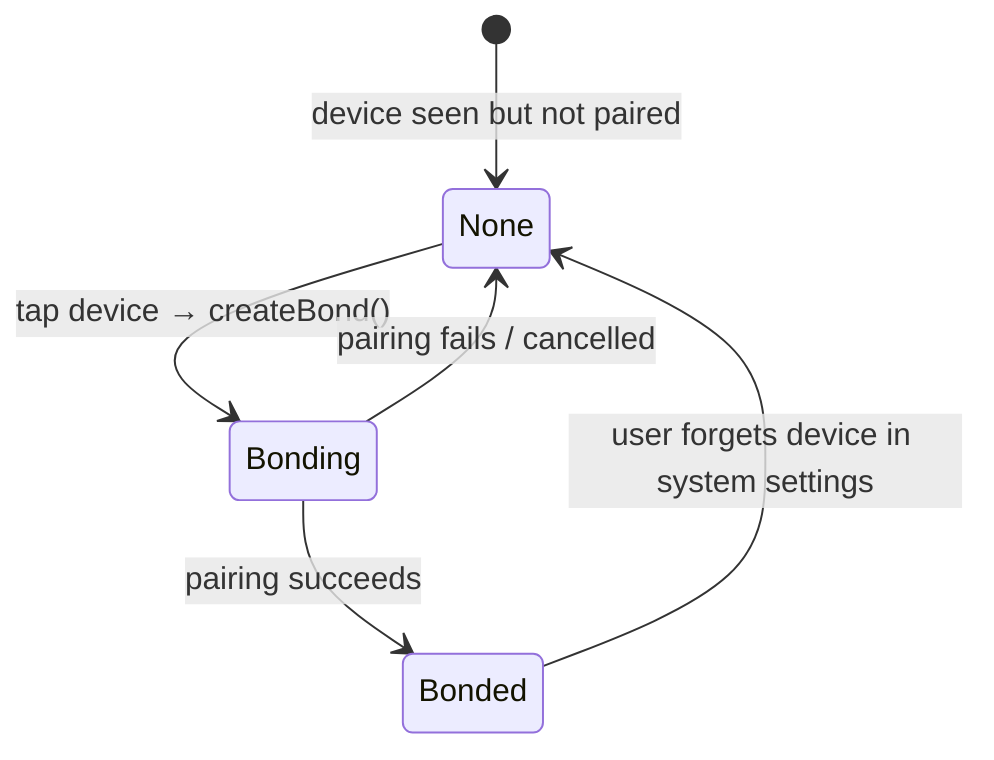

**App behavior on tap**

- Already `Bonded` → select it and tell the user it is ready (system audio connect may still be needed)
- `Bonding` → show pairing status
- `None` → call `createBond()`

---

### 5. Device selection in the UI (medium)

`selectedAddress` is independent from “currently playing.”

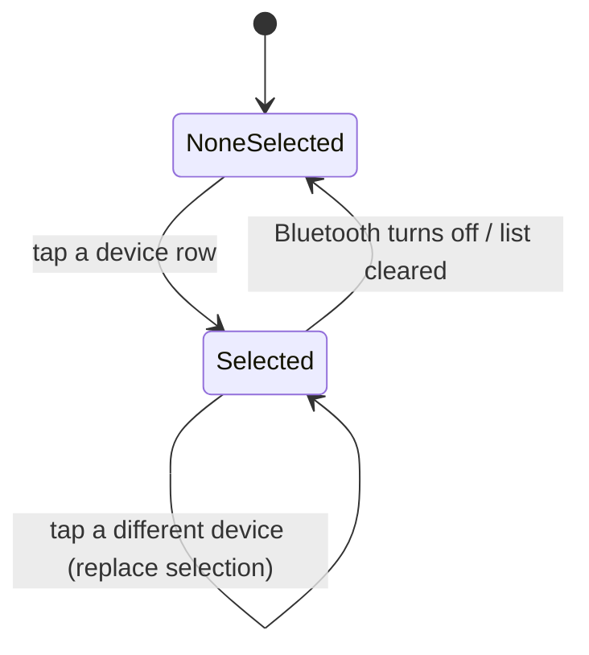

Play is enabled only when `selectedAddress != null`.

---

### 6. Track playback (medium)

`TrackPlayer` + `PlayerUiState.isPlaying`.

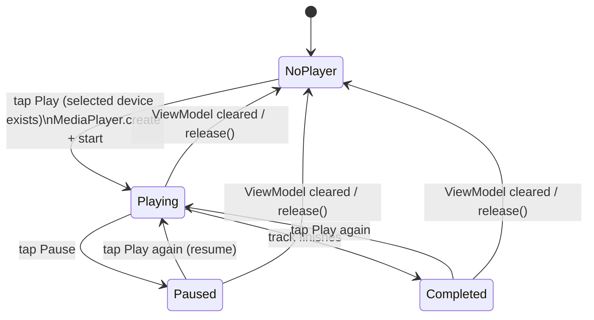

Today, completion does not flip `isPlaying` back to `false` in the ViewModel — a small gap to improve later.

---

### 7. Audio output route (medium — mostly system)

The app plays locally; Android chooses the output device.

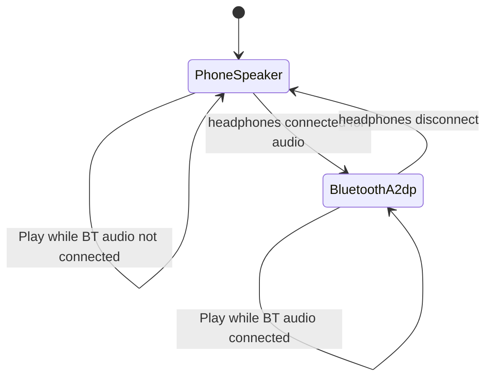

This is why “paired in the app” ≠ “hear sound in the headphones” until system Bluetooth shows them connected.

---

### 8. App session lifecycle (complex)

How the main screen progresses from launch toward playing music.

```mermaid
stateDiagram-v2
  [*] --> Launch
  Launch --> NeedPermissions: permissions missing
  Launch --> Ready: permissions already granted

  NeedPermissions --> Ready: Grant permissions succeeds
  NeedPermissions --> NeedPermissions: denied (can ask again)

  Ready --> BtOff: Bluetooth disabled
  Ready --> IdleReady: Bluetooth on
  BtOff --> IdleReady: Bluetooth turned on

  IdleReady --> Scanning: tap Scan
  Scanning --> IdleReady: scan finished / stopped

  IdleReady --> DeviceChosen: tap device (pair or already paired)
  Scanning --> DeviceChosen: tap device (scan cancelled, then pair/select)

  DeviceChosen --> IdleReady: selection lost (e.g. BT off)
  DeviceChosen --> Playing: tap Play
  Playing --> DeviceChosen: tap Pause
  Playing --> DeviceChosen: track ends (ideal; UI flag may lag today)
```

---

### 9. Concurrent machines (complex)

In reality several machines run at once. The UI state is mostly the product of these flags.

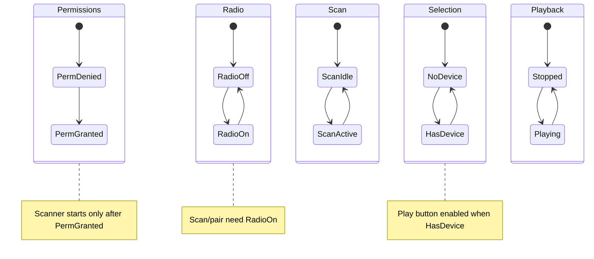

**Rough guard rules used today**

| Action | Needs |
| --- | --- |
| Start scanner | Permissions granted |
| Start scan | Permissions + Bluetooth on |
| Pair / select device | Permissions |
| Play / Pause | A selected device address |

---

### 10. Full learning picture (most complex)

Includes what we build now **plus** the A2DP “really connected for audio” idea for later.

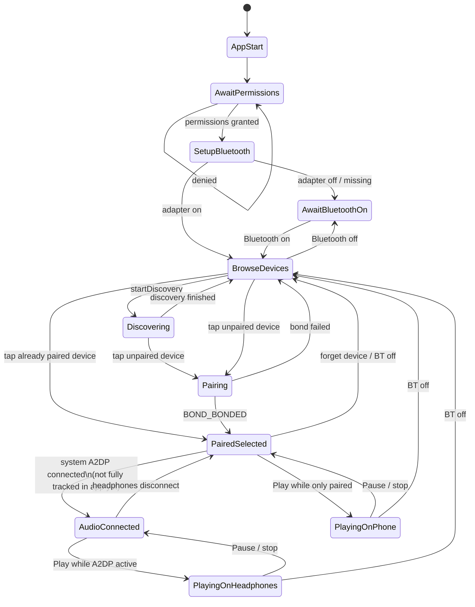

**How to read this**

1. Left side of the journey = permissions + radio + scan (**implemented**)
2. Middle = pair + select (**implemented**)
3. Right side audio-connected / play-on-headphones = **partly system-managed**; detecting A2DP explicitly is a natural next feature

---

### Quick map: diagram → code

| Machine | Main fields / APIs |
| --- | --- |
| Permissions | `hasPermissions`, permission launcher in `MainActivity` |
| Bluetooth radio | `bluetoothAvailable`, `bluetoothEnabled`, `ACTION_STATE_CHANGED` |
| Scan | `isScanning`, `startDiscovery`, `ACTION_FOUND` |
| Bond | `DiscoveredDevice.bondStateLabel`, `createBond`, `ACTION_BOND_STATE_CHANGED` |
| Selection | `selectedAddress` |
| Playback | `isPlaying`, `TrackPlayer` / `MediaPlayer` |
| Audio route | system A2DP (not a dedicated app state yet) |
