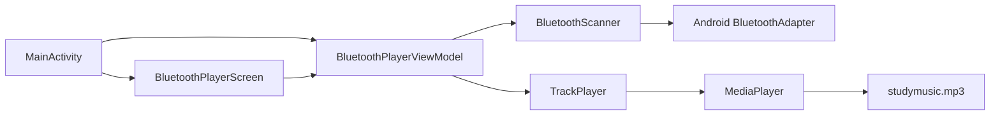
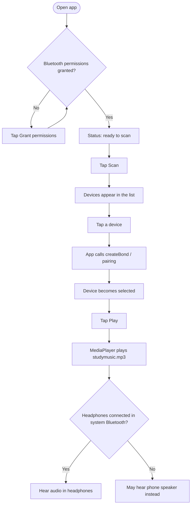
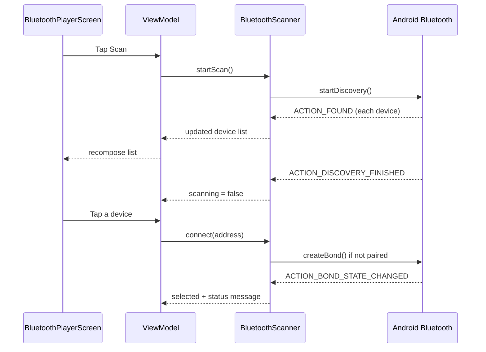
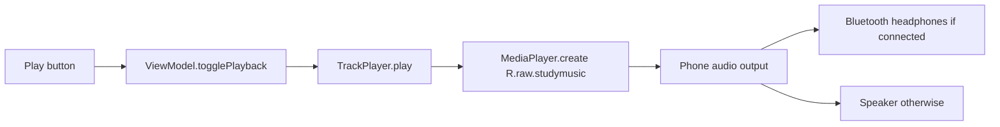

# Bluetooth Music Player

A beginner Android project for learning **Bluetooth** by building a small media player that can find headphones, pair with them, and play one local MP3 track.

**Goal so far:** scan for nearby Bluetooth devices, show them in a simple UI, pick headphones to pair with, then play `studymusic.mp3` from `res/raw`.

---

## What this app does right now

1. Asks for Bluetooth permissions
2. Scans for nearby (and already paired) Bluetooth devices
3. Lists them in a Compose UI (audio/headphone-looking devices first)
4. Lets you tap a device to start pairing
5. Plays `R.raw.studymusic` with `MediaPlayer` when you tap **Play**

**Important beginner note:** pairing a device is not always the same as having audio going to the headphones. Android usually routes music to headphones only after they are **connected** as an audio device in system Bluetooth settings. The app plays the track either way; if headphones are not the active audio output, you may hear the phone speaker instead.

---

## Project pieces (big picture)



| Piece | Role |
| --- | --- |
| `MainActivity` | App entry point. Requests permissions and shows the UI. |
| `BluetoothPlayerScreen` | Compose UI: status, Scan/Play buttons, device list. |
| `BluetoothPlayerViewModel` | Holds UI state and connects the screen to Bluetooth + music. |
| `BluetoothScanner` | Starts discovery, listens for found devices, starts pairing. |
| `DiscoveredDevice` | Simple data model for one row in the list (name, address, paired?). |
| `TrackPlayer` | Thin wrapper around `MediaPlayer` for play / pause / stop. |
| `AndroidManifest.xml` | Declares Bluetooth permissions the app needs. |
| `res/raw/studymusic.mp3` | The one track we play. |

---

## User flow



---

## How Bluetooth scanning works here

Classic Bluetooth discovery (the “find nearby devices” style) is used — good for many headphones.



### Beginner terms

- **Scan / discovery:** the phone listens for nearby Bluetooth devices advertising themselves.
- **Bond / pair:** save a trusted relationship with the device (PIN/confirm if needed).
- **Connect (audio):** the headphones are actively linked for sound (A2DP). The system usually manages this; our app currently focuses on scan + pair + play.
- **MAC address:** the unique `AA:BB:…` id shown under each device name.

---

## How playback works here



The app does **not** manually “send MP3 bytes over Bluetooth.” It plays locally with `MediaPlayer`; Android’s audio system chooses the output device.

---

## Permissions (why the app asks)

| Android version | Permissions used |
| --- | --- |
| API 31+ (Android 12+) | `BLUETOOTH_SCAN`, `BLUETOOTH_CONNECT` |
| Older | `BLUETOOTH`, `BLUETOOTH_ADMIN`, `ACCESS_FINE_LOCATION` |

These are declared in `AndroidManifest.xml` and requested at runtime from `MainActivity`.

---

## Folder map

```text
app/src/main/
├── AndroidManifest.xml
├── java/com/rick/bluetoothmusicplayer/
│   ├── MainActivity.kt
│   ├── BluetoothPlayerViewModel.kt
│   ├── audio/
│   │   └── TrackPlayer.kt
│   ├── bluetooth/
│   │   ├── BluetoothScanner.kt
│   │   └── DiscoveredDevice.kt
│   └── ui/
│       ├── BluetoothPlayerScreen.kt
│       └── theme/          (Material theme colors/fonts)
└── res/raw/
    └── studymusic.mp3
```

---

## Try it

1. Run the app on a real phone (Bluetooth headphones are much easier to test than an emulator).
2. Grant permissions.
3. Put headphones in pairing mode → **Scan**.
4. Tap the headphones in the list to pair/select.
5. In phone **Settings → Bluetooth**, confirm they show as connected.
6. Tap **Play**.

---

## What’s next (not built yet)

Ideas for later learning steps:

- Detect whether headphones are actually **connected** for audio (A2DP state), not only paired
- Auto-play when headphones connect
- Show playback progress / seek bar
- Stop scan automatically after a timeout
- Clearer “connected vs paired” labels in the UI
